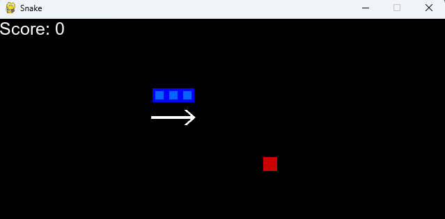
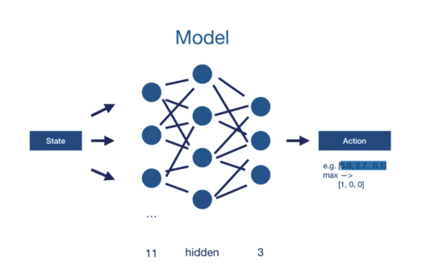
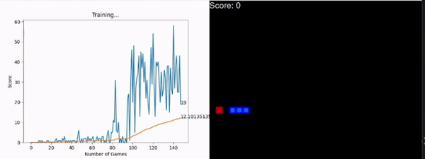

# Snake Game AI

This application is a demonstration of how Reinforcement Learning can be used to teach an AI to play the classic Snake game. The AI learns to play the game through a method called Deep Q Learning, which uses a deep neural network to predict the actions the AI should take.

The original game source code can be found at: https://github.com/patrickloeber/python-fun/tree/master/snake-pygame

## Libraries Used

This project uses several libraries including:

- PyTorch: A machine learning library used for creating the AI model.
- Pygame: A game development library used for creating the Snake game.
- Matplotlib: A plotting library used for visualizing the AI's progress.
- Collections: A Python standard library used for creating a memory for the AI to remember past actions.
- Model: A custom library used for defining the AI model.
- Helper: A custom library used for various helper functions.

## Theory

### Reinforcement Learning

Reinforcement Learning (RL) is a field of machine learning that focuses on teaching software agents how to take actions in an environment to maximize a cumulative reward. In the context of this project, the software agent is the AI playing the Snake game, and the environment is the game itself.

source: [wikipedia](https://en.wikipedia.org/wiki/Reinforcement_learning)

### Deep Q Learning

Deep Q Learning is an extension of reinforcement learning that uses a deep neural network to predict the actions the software agent should take. In this project, the deep neural network is used to predict the movements of the snake in the game.

source: [geeksforgeeks](https://www.geeksforgeeks.org/deep-q-learning/)

## How It Works

The AI agent interacts with the game and the model in the following way:

1. The agent gets the current state of the game.
2. The agent decides on an action to take based on the current state.
3. The agent performs the action in the game, which results in a reward and a new game state.
4. The agent remembers the action, reward, and new state.
5. The agent trains the model based on the remembered information.

The game (created with Pygame) and the model (created with PyTorch) interact with the agent as follows:

- The game provides the agent with a reward and a new game state whenever the agent performs an action.
- The model predicts the best action for the agent to take based on the current game state.

## Rewards

The agent receives rewards based on its actions:

- Eating food: +10
- Game over (the snake hits the border or itself): -10
- Any other action: 0

## Actions

The agent can take one of three actions:

- Go straight: [1,0,0]
- Turn right: [0,1,0]
- Turn left: [0,0,1]

## State

The state of the game is represented by an array of 11 values:

- Danger straight, danger right, danger left
- Direction left, direction right, direction up, direction down
- Food left, food right, food up, food down

Example:

[0, 0, 0,  
 0, 1, 0, 0,  
 0, 1, 0, 1]

## Model

This model comprises three layers: an input layer with 11 inputs, a hidden layer, and an output layer.

## Deep Q Learning Process

The Deep Q Learning process involves the following steps:

1. Initialize the Q value (which is done by initializing the model).
2. Choose an action based on the current game state.
3. Perform the chosen action in the game.
4. Measure the reward from performing the action.
5. Update the Q value based on the reward (which is done by training the model).
6. Repeat from step 2.

## Loss Function

I utilize the Bellman Equation as the loss function in this model.

## Requirements

To run this project, you will need the following libraries:

- pygame
- pytorch
- matplotlib
- ipython

## Output

As the AI trains, you will see it improve at playing the Snake game. You can visualize the AI's progress using matplotlib.

## Conclusion

This project is a fun and interactive way to understand how Reinforcement Learning and Deep Q Learning work. By watching the AI improve at the Snake game, you can see these concepts in action.

In conclusion, the AI demonstrates a commendable ability to accrue points efficiently; however, a notable limitation is evident from the observed GIF, where it falls into a self-induced loop, ultimately leading to game over. To address and enhance this issue, it would be imperative to implement a mechanism enabling the AI to detect and navigate away from such looping situations. By incorporating a feature that recognizes and responds to these scenarios, we can enhance the overall performance and adaptability of the AI in playing the game. This adaptive strategy would contribute significantly to the AI's ability to navigate complex environments and improve its overall gameplay experience.